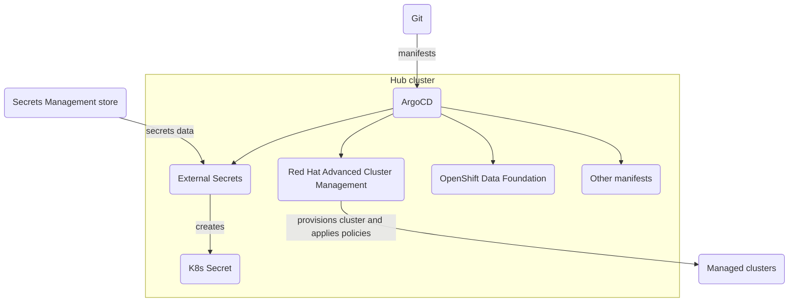

# Overview

One Touch Provisioning (OTP) is a set of patterns that enales the seamless end-to-end provisioning of Red Hat OpenShift clusters, Kubernetes-native applications, governance and policies to Public, Private, On-Premises, and both Near and Far Edge Clouds, all via Code.

While this pattern is used in IBM demos and MVPs, it is not supported by IBM.

## Motivation

This project was born out of the need to stand up clusters and deploy applications in a standardised manner quickly and consistently in [IBM Client Engineering](https://www.ibm.com/client-engineering) projects. IBM Client Engineering is a global pre-sales organisation. It's an IBM investment to our customers. We take the customers through a series of workshops to understand their business needs, perform gap analysis, and build a Proof of X (Value, Concept, Technology), to show how IBM technologies can solve these business needs. IBM technologies refer to IBM Cloud Pak (Data, Business Automation, Security, Watson AIOps, etc.), Red Hat OpenShift Plus portfolio, AI Apps offerings (Maximo, Sterling, etc.). This end-to-end journey typically runs for 4 weeks or less. 

With the fast pace rqeuirement of a Client Engineering engagement, [Ben Swinney](https://www.linkedin.com/in/ben-swinney), [Nick Merrett](https://www.linkedin.com/in/nick-merrett/) and [Cong Nguyen](https://www.linkedin.com/in/cong-ng/) from Client Engineering A/NZ worked on a point-of-view (PoV) on how we can deploy IBM Cloud Pak to 10s and 100s of Red Hat OpenShift clusters on any clouds, any infrastructure providers, as long as the products support those clouds.

However, installation of these products on a single infrastructure is just a small part of the whole picture. Most organisations we work with have constraints and drivers for the installation and management of these clusters as a whole.

Top down, CIO/CTOs need to:

- Streamline operations across different teams
- Accomodate different consumption patterns and provide self-service services for the organisation
- Control spending and budget
- Have visibility across resources for security
- Apply policies and controls for risk and compliance

Bottom up, build teams and run teams have different needs:

- Restricted to build on approved infrastructure providers
- Manage configuration drift for their deployed projects
- Tend to favour self-service cloud consumption models like PaaS and SaaS
- Depending on the industry, comply with multi-cloud regulations

When we map these business drivers to technologies, a lot of these are solved problems with Red Hat and IBM technologies, most of them are open source.

| Business need                                        | Technology (Open-source equivalence)                                |
|------------------------------------------------------|---------------------------------------------------------------------|
| Multi-cluster and multi-cloud application deployment | Red Hat Advanced Cluster Management (Open Cluster Management, Hive) |
| Cluster management                                   | Red Hat Advanced Cluster Management (Open Cluster Management, Hive) |
| Multi-cluster policies management                    | Red Hat Advanced Cluster Management (Open Cluster Management)       |
| Cross-infra storage abstraction                      | OpenShift Data Foundation (Rook.io), IBM Spectrum Fusion            |
| Consistent manifest deployment and management        | OpenShift GitOps (ArgoCD)                                           |
| Virtual machine deployment                           | OpenShift Virtualization (Kubevirt)                                 |

## Architecture

In this pattern, Git is the central integration point and source of truth. OpenShift GitOps (ArgoCD) is the driver. It fetches config from Git, manage configuration drift and apply them to the cluster. Red Hat Advanced Cluster Mangement (RHACM) picks up these manifests and do the work. It provides cluster provisioning, multi-cluster application deployment, policies enforcement capabilities.

Using ArgoCD as the integration point, we treat infrastructure and cluster management as applications. We can define the order of deployment of interdependent resources using ArgoCD [sync waves](https://argo-cd.readthedocs.io/en/stable/user-guide/sync-waves/), and use ArgoCD [AppProject](https://argo-cd.readthedocs.io/en/stable/user-guide/projects/) to restrict namespaces and clusters that can be used.

### Code structure

One Touch Provisioning adopts the [Kubernetes Ownership Model](https://itnext.io/the-kubernetes-ownership-model-50802b9f264). We assume that each organisation would have teams dedicated to the management and deployment of their own tech stack. These teams create templates and deployment manifests for their business unit, sometimes for the entire organisation, e.g.: the risk and compliance team.

OTP is consisted of 6 repositories: 1 bootstrap repository `otp-gitops`, containing the ArgoCD Applications, and 5 template repositories: `otp-gitops-infra`, `otp-gitops-services`, `otp-gitops-clusters`, `otp-gitops-apps` and `otp-gitops-policies`. These tepmlate repositories source code are pulled into `otp-gitops` bootstrap repository. The figure below shows an example mapping of templates available in each repository and their usage in the bootstrap repository.

By splitting up the codebase into layers, we give the maintenance of the source repositories to the teams who have the most expertise in that subject matter. Cloud engineers from feature teams can consume a set of templates, source repositories from central IT and risk compliance teams.

Operationally, we would want ot ensure these repositories are inner-sourced, so teams can review and innovate upon them.
